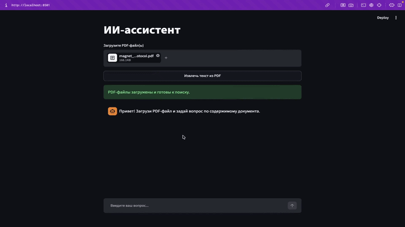

# Lab-assistant 🤖

Чат бот для помощи в работе с протоколами и выписками пациентов. Загрузите PDF документ и задайте интересующий вас вопрос.

<p align="center">
  
</p>

## Установка

Чтобы настроить и запустить локально, выполните следующие шаги:

1. **Клонируйте репозиторий**:
    ```bash
    git clone https://github.com/Tturrbo/Lab-assistant.git
    cd Lab-assistant
    ```

2. **Создайте и активируйте виртуальное окружение**:
    ```bash
    python -m venv .venv
    source venv/bin/activate
    ```

3. **Установите зависимости**:
    ```bash
    pip install -r requirements.txt
    ```

4. **Настройте переменные окружения**:
    - Создайте файл `api_key.txt` в корневой директории проекта.
    - Добавьте ваш API-ключ Groq:
        ```env
        gsk_********************
        ```

5. **Запустите Streamlit**:
    ```bash
    streamlit run app.py
    ```